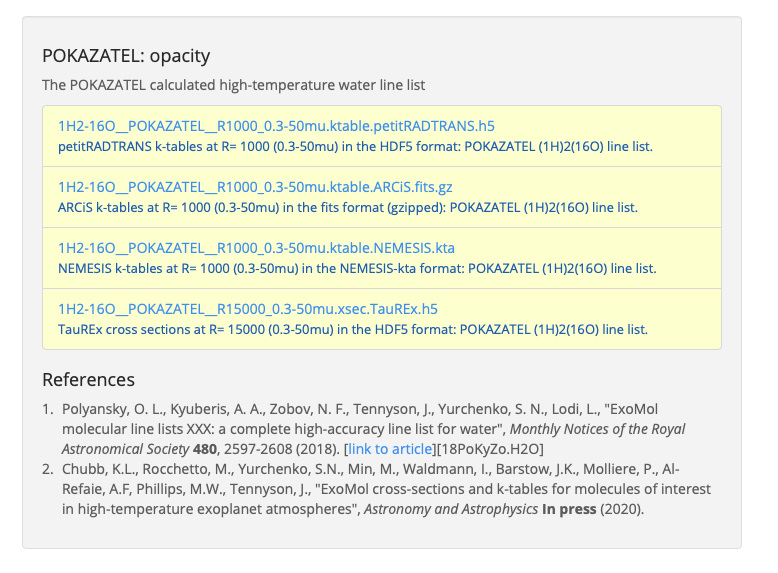

================
Adding opacities
================
petitRADTRANS has an extensive database of line opacities. However, it is very likely that we are missing the one atom / molecule that you want. There are three options for adding external opacities to petitRADTRANS:

1. :ref:`ExoMolpRT`. These are already in the petitRADTRANS format and can be used in a plug-and-play fashion.
2. :ref:`OWtopRT`.
3. :ref:`Calculating opacities from line lists yourself<ECtopRT>`, and converting them to the petitRADTRANS format.

These different options are explained in more detail below.

.. _ExoMolpRT:

Importing opacity tables from the ExoMol website
================================================
The line lists available on the `ExoMol website <http://www.exomol.com>`_ are available as opacity tables in the format of various retrieval codes, see `Chubb et al. (2020) <https://arxiv.org/abs/2009.00687>`_, including petitRADTRANS. They can be downloaded `on the ExoMol website <http://www.exomol.com/data/data-types/opacity/>`_. These opacity grids have been calculated for temperatures ranging from 100 to 3400 K (:math:`\Delta T = 100 \ {\rm K}` for :math:`T \in [100-2000] \ {\rm K}` and :math:`\Delta T = 200 \ {\rm K}` for :math:`T \in [2000-3400] \ {\rm K}`) and 22 pressure points spaced equidistantly in log-space, from :math:`10^{-5}` to 100 bar. Thermal and pressure broadening have also been included, see `Chubb et al. (2020) <https://arxiv.org/abs/2009.00687>`_ for more information.

.. note:: If you use petitRADTRANS at pressures and temperatures outside of this grid, petitRADTRANS will use the opacity at the grid point closest to the pressure and temperature specified in your calculation.

Opacity files are available for the two petitRADTRANS opacity modes:
- Correlated-k (:math:`\lambda/\Delta\lambda=1000`) mode: the file extension is ``.ktable.petitRADTRANS.h5``.
- Line-by-line (:math:`\lambda/\Delta\lambda=15000`) mode: the file extension is ``.xsec.TauREx.h5``.

To use these opacities:

1. In the ExoMol website, navigate to a species' dataset, e.g. `here <http://www.exomol.com/data/molecules/H2O/1H2-16O/POKAZATEL/>`_.
2. Scroll to the "opacity" section (see screenshot), and click on the link to download the petitRADTRANS opacity table.

3. On your computer, go to the ``path_to_input_data/opacities/lines/`` directory. Replace ``path_to_input_data`` with your input_data path. See :doc:` <notebooks/getting_started>` to see how to locate your input_data directory, then:
    - for correlated-k files, go to the ``correlated-k`` directory,
    - for line-by-line files, go to the ``line-by-line`` directory.
4. If it does not exists, create a folder with the ExoMol's species chemical formula (e.g. ``H2O``). In case of doubt, check the URL of the file's webpage.
5. Go within this new directory. If it does not exists, create a folder with the ExoMol's species istopologue formula (e.g. ``1H2-16O``). This formula is in the name of the file you downloaded.
6. Put the downloaded ``.h5`` file into this new folder.

You're done!

.. _OWtopRT:

Converting cross-section grids from `DACE`_
===========================================
Pre-computed opacities are also available from `DACE`_,
which have been generated using the method presented in `Grimm & Heng (2015)`_ .
The DACE opacity database itself is described in
`Grimm et al. (2021) <https://ui.adsabs.harvard.edu/abs/2021ApJS..253...30G/abstract>`_.
The website allows to download the cross-section tables as a function
of pressure and temperature. Proceed as follows:
1. Decide on any P-T range line list that you are interested
in. Note that their spectral coordinate is wavenumber, in units of
:math:`{\rm cm}^{-1}`.
2. Decompress the opacities.
3. Convert DACE opacities into the petitRADTRANS format:

.. code-block:: python

    from petitRADTRANS.__file_conversion import format2petitradtrans

    format2petitradtrans(
        load_function='dace',
        opacities_directory='path/to/decompressed/dace/opacities',  # replace with actual directory
        natural_abundance=False,
        source='opacity source name',  # replace with the source name, e.g. 'POKAZATEL'
        doi='doi of the source',  # can be e.g. '' for personal usage
        species='speciesFormula'  # species chemical formula, e.g. 'H2O'
    )

The converted correlated-k and line-by-line files will be put automatically inside your input_data directory. You can then use the converted opacities as any other petitRADTRANS opacity.

.. _DACE: https://dace.unige.ch/opacityDatabase/

.. _ECtopRT:

Converting line lists to opacities using ExoCross
=================================================

Generating the ExoCross opacities
---------------------------------
Before we can use it, any line list needs to be converted into actual opacities. In this example we will show you how to do this using ExoCross, the open-source opacity calculator of the `ExoMol`_ database.

ExoCross can be downloaded on the `ExoCross website <https://github.com/Trovemaster/exocross>`_, and is described in `Yurchenko et al. (2018)`_. For more details, see the `ExoCross documentation <https://exocross.readthedocs.io>`_.

.. _ExoMol: http://www.exomol.com
.. _Yurchenko et al. (2018): https://arxiv.org/abs/1801.09803

First, download the ExoCross source, go into the folder containing the source and the makefile called "makefile". Adapt that to your liking. For example, if you have the gfortran compiler, but not ifort, make sure that the flag using ifort is commented out, and that it uses fortran. The relevant lines in "makefile" should look like this:

.. code-block:: bash

    #FOR  = ifort
    #FFLAGS =  -O3 -qopenmp -traceback  -ip
    FOR = gfortran
    FFLAGS = -O2 -fopenmp -std=f2008

Then, build ExoCross by typing ``make`` in the terminal. Sometimes the compiler will complain that lines within the ExoCross source are too long. Just open the source and introduce a line break there manually, like this:

.. code-block:: fortran

    ! This is an example for a line that is too long
    DOUBLE PRECISION :: very_long_variable_name_number_one, very_long_variable_name_number_two, very_long_variable_name_number_three

    ! This is how you introduce line breaks
    DOUBLE PRECISION :: very_long_variable_name_number_one, &
       very_long_variable_name_number_two, &
       very_long_variable_name_number_three

So the ``&`` is th line break operator. After fixing this, recompile using ``make``.

In this example we will calculate the opacities of the NaH molecule. All necessary files for calculating opacities can be found on the ExoMol website, just `click here`_.

.. _click here: http://www.exomol.com/data/molecules/NaH/23Na-1H/Rivlin/

The following files need to be downloaded:

- 23Na-1H__Rivlin.states.bz2
- 23Na-1H__Rivlin.trans.bz2
- 23Na-1H__Rivlin.pf

Please unzip the .bz2 files before use.

Next, make an input file for carrying out the calculations, in this example we call it NaH_input.inp. This is what it looks like:

.. code-block:: bash

    absorption
    voigt
    verbose 3
    offset 60.
    mass 24
    temperature 1000.000000
    pressure 0.00001
    range 39. 91000.
    R 1000000
    pffile 23Na-1H__Rivlin.pf
    output NaH_1000K_1em5bar.out
    states 23Na-1H__Rivlin.states
    transitions
      "23Na-1H__Rivlin.trans"
    end
    species
      0 gamma 0.06 n 0.5 t0 296 ratio 1.
    end

This calculates the opacity of NaH with the following settings:
- ``offset`` results in a line cutoff of 60 :math:`{\rm cm}^{-1}`. While being an important effect that also speeds up calculations, the choice of a cutoff is often arbitrary because the physics behind it remain difficult to model, see, for example the discussion in `Grimm & Heng (2015)`_. Here we use the equivalent width of the line decrease function given by `Hartmann et al. (2002)`_, for :math:`\rm CH_4` broadened by :math:`\rm H_2`.
- NaH has a mass of 24 (in amu)
- The opacity is calculated at a temperature of 1000 K
- The opacity is calculated at a pressure of :math:`10^{-5}` bar
- The opacity is calculated in the range from 39 to 91000 :math:`{\rm cm}^{-1}`. This corresponds to a wavelength range from 0.1099 to 256.4103 micron, therefore bracketing the full petitRADTRANS wavelength range (0.11 to 250 micron at low resolution). This large a range is needed. Therefore, do not change this. Note that the opacities in the high-resolution mode of petitRADTRANS ultimately only go from 0.3 to 28 microns.
- The resolution of the calculations carried out here is for a wavelength spacing of :math:`\lambda/\Delta\lambda=10^6`.
- The ``pfile`` line gives the relative path to the partition function file, that you have already downloaded from ExoMol.
- The ``states`` line gives the relative path to the states file, that you have already downloaded from ExoMol.
- The lines below ``transitions`` line give the relative paths to the transition files, that you have already downloaded from ExoMol. For NaH this is only one file. For molecules with a lot more lines this can be multiple files.
- The lines below ``species`` define the pressure broadening to be used. This pressure broadening (width of the Lorentz profile) is of the form :math:`\gamma \cdot (T_{0}/T)^n ({\rm ratio}\cdot P/{\rm 1 \ bar})`, in units of :math:`\rm cm^{-1}`. The choice here is a compromise between the various values reported for the broadening by :math:`\rm H_2/He` of various absorbers, e.g. in `Amundsen et al. (2014)`_, `Gharib-Nezhad & Line (2018)`_. Also see the text around Equation 12 in `Sharp & Burrows (2007)`_ for more information. Sometimes more detailed broadening information is available on ExoMol, `see here`_.

.. _Hartmann et al. (2002): http://adsabs.harvard.edu/abs/2002JQSRT..72..117H
.. _Grimm & Heng (2015): https://arxiv.org/abs/1503.03806
.. _Amundsen et al. (2014): https://arxiv.org/abs/1402.0814
.. _Gharib-Nezhad & Line (2018): https://arxiv.org/abs/1809.02548v2
.. _Sharp & Burrows (2007): https://arxiv.org/abs/astro-ph/0607211
.. _see here: http://www.exomol.com/data/data-types/broadening_coefficients/

If more detailed broadening information is available (not for NaH) you can replace the lines below ``species`` with something like

.. code-block:: bash

    species
      0 gamma 0.06 n 0.5 t0 296 file path_toH2_broadening_information_file model J ratio 0.860000
      1 gamma 0.06 n 0.5 t0 296 file path_toHe_broadening_information_file model J ratio 0.140000
    end

The above setting is for a primordial composition atmosphere, where :math:`\rm H_2` and He roughly make up 86 % and 14 % of the atmosphere, respectively (i.e. these are volume mixing ratios, not mass fractions). The :math:`\gamma` and :math:`n` values given before the path to the broadening files are what is used for rotational quantum numbers (:math:`J`) not covered by the broadening files.

Finally, the opacities are calculated by running ExoCross from the terminal command line via

.. code-block:: bash

     ./xcross.exe < NaH_input.inp > test_run.out

The resulting wavelength-dependent opacity will be in the "NaH_1000K_1em5bar.out.xsec" file, in our example here. In the end quite a few opacity points need to be calculated for petitRADTRANS (for example at 130 or 200 different pressure-temperature combinations, see below). This is doable on a local machine for smaller line lists such as NaH, but may require the use of a cluster for much larger line lists.

There also exists the so-called super-line treatment `(see Yurchenko et al. 2018)`_, where multiple lines are combined into one, this can speed up calculations a lot, but is not recommended if you want to calculate high-resolution spectra with petitRADTRANS (because line positions will shift if multiple lines are combined into one on a fixed wavelength grid during the super-line treatment).

.. _(see Yurchenko et al. 2018): https://arxiv.org/abs/1801.09803

.. _EXtopPRT:

Converting the ExoCross opacities into the petitRADTRANS format
---------------------------------------------------------------
For creating opacities for use in petitRADTRANS, calculate the
molecular opacities from ExoMol with ExoCross using the settings
outlined above.

The opacities can be calculated on any rectangular pressure temperature grid (the distance between grid points may be variable, but it **must** be rectangular for use in petitRADTRANS). An example are the original 130 P-T points of petitRADTRANS. Temperatures go from 80 up to 3000 K, in a log-uniform way.

Now, let's turn towards preparing the ExoCross results for petitRADTRANS. We will assume that you have calculated the opacities at all 130 pressure-temperature points. The high-resolution wavelength setup between ExoCross and our classical petitCODE/petitRADTRANS opacity calculator is slightly different. ExoCross' wavelength spacing varies a bit around the user-defined resolution, whereas our routines preparing the opacity files for petitRADTRANS assume that the wavelength spacing is exactly :math:`\lambda/\Delta\lambda=10^6`, from 0.11 to 250 microns. Hence we will first have to rebin the ExoCross results to the petitCODE/petitRADTRANS grid. To this end, please download the petitRADTRANS high resolution grid (`wavenumber_grid.petitRADTRANS.h5`_).

.. _`wavenumber_grid.petitRADTRANS.h5`: https://keeper.mpdl.mpg.de/d/c90c79171ec044039650/

Next, execute the following command:

.. code-block:: python

    from petitRADTRANS.__file_conversion import format2petitradtrans

    format2petitradtrans(
        load_function='exocross',
        opacities_directory='path/to/exocross/opacities',  # replace with actual directory
        natural_abundance=False,
        source='opacity source name',  # replace with the source name, e.g. 'POKAZATEL'
        doi='doi of the source',  # can be e.g. '' for personal usage
        species='speciesFormula'  # species chemical formula, e.g. 'H2O'
    )

The converted correlated-k and line-by-line files will be put automatically inside your input_data directory. You can then use the converted opacities as any other petitRADTRANS opacity.

Converting any opacity into the petitRADTRANS format
====================================================
We provide the tool to convert any opacity file into the petitRADTRANS format. All that is needed is a Python function that follows the structure below:

.. code-block:: python

    def my_load_function(file, file_extension, molmass, wavelength_file, wavenumbers_petitradtrans,
                  save_line_by_line, rebin, selection):

        ...

        return opacities, opacities_line_by_line, wavenumbers, pressure, temperature

Not all the input arguments need to be used. For the outputs, take care of the following:
- ``opacities`` must be in cm2/molecule.
- ``opacities_line_by_line`` must be in cm2/molecule, and interpolated to ``wavenumbers_petitradtrans``.
- ``wavenumbers`` must be the wavenumbers corresponding to ``opacities``, in cm-1.
- ``pressure`` must be in bar.
- ``temperature`` must be in K.

Ideally, ``my_load_function`` must be applied to one file containing the opacities at one pressure and one temperature.

You can then proceed to the conversion as follows:

.. code-block:: python

    from petitRADTRANS.__file_conversion import format2petitradtrans

    format2petitradtrans(
        load_function=my_load_function,  # replace with
        opacities_directory='path/to/my/opacities',  # replace with actual directory
        natural_abundance=False,
        source='opacity source name',  # replace with the source name, e.g. 'POKAZATEL'
        doi='doi of the source',  # can be e.g. '' for personal usage
        species='speciesFormula'  # species chemical formula, e.g. 'H2O'
    )

Using arbitrary (but rectangular) P-T opacity grids in petitRADTRANS
====================================================================
In your petitRADTRANS calculations you can combine species with different P-T grids,
for different species, petitRADTRANS will simply interpolate within the species' respective T-P grid.
If the atmospheric T and P leave the respective grid, it will take the opacity of that species at the values of the nearest grid boundary point.
